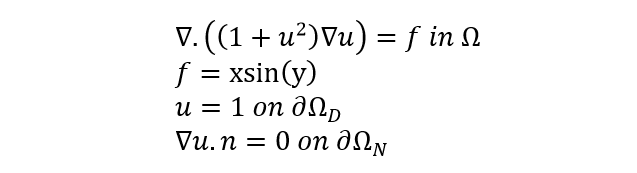

# PDEsolver(Physics-Informed Neural Networks - non-linear Poisson equation using Siren (Sinelayer Neural Networks)
## Motivation: 
The following sample problem will demonstrate that deep neural network can be utilized to approximate the solutions of partial differential equations (PDEs). This is a recent area of research, known as Physics Informed Neural Networks (PINNS). With this approach, a loss function is setup to penalize the fitted function’s deviation from the desired differential operator and boundary conditions. The main insight of this approach lies in the fact that the training data consists of randomly sampled points in the function’s domain. By sampling mini-batches from different parts of the domain and processing these small batches sequentially, the neural network “learns” the function without the computational bottleneck present with grid-based methods.

## Problem:
Let us consider a non-linear Poisson equation: first equation

∇.((1+u^2 )∇u)=f in Ω

f=xsin(y)

u=1 on ∂Ω_D

∇u.n=0 on ∂Ω_N

1-	Deriving the variational formulation of the non-linear Poisson equation

2-	The code to solve the non-linear Poisson Equation above is given on the next page. How does the overall error for u decreases as you increase the mesh size to [10,10], [20,20] and [40,40]. Use a reference solution on a grid of [200,200] to compute the error. 
	Note: You will need to install the FEniCS library and Matplotlib to run the code. Use “conda” for installation.

3-	Modify the code to integrate it with TensorFlow. Train a neural network, N_h, on a low-resolution grid (e.g. [5,5], [10,10]). Use this trained neural network, N_h,  with a high-resolution grid to produce the predicted solution. 

